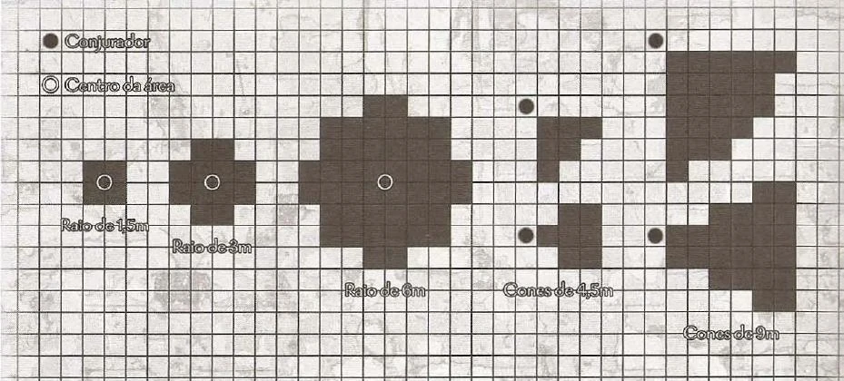

# QuestHub — Ferramenta de Templates de Área

**Status:** Especificação funcional e técnica inicial  
**Escopo:** VTT da campanha  
**Responsável pela utilização:** Mestre da campanha



---

## 1. Objetivo

Criar uma ferramenta na toolbar do VTT que permita ao Mestre:

1. pré-configurar modelos reutilizáveis de áreas;
2. armazenar esses modelos exclusivamente dentro da campanha;
3. posicionar uma área sobre a cena;
4. visualizar as células cobertas pela área;
5. identificar os tokens tocados pela área;
6. destacar cada token tocado com um anel ao seu redor;
7. manter ou remover a área após a confirmação, conforme a configuração do modelo.

A ferramenta não deve depender das regras de Pathfinder, D&D ou qualquer outro sistema específico. O QuestHub deverá fornecer propriedades geométricas e comportamentais genéricas, e o Mestre combinará essas propriedades para reproduzir as regras do sistema utilizado na campanha.

---

## 2. Princípios arquiteturais

### 2.1. Tudo pertence à campanha

- Todo template de área deve possuir `campaignId`.
- Um template criado em uma campanha não pode aparecer em outra campanha.
- Uma área posicionada em uma cena deve possuir `campaignId` e `sceneId`.
- Nenhuma configuração, instância ou vínculo pode vazar entre campanhas.
- Uma futura função de importar ou copiar deverá criar uma nova cópia pertencente à campanha de destino.

### 2.2. A ferramenta não é exclusiva para magias

O mesmo motor deve poder representar:

- magias;
- habilidades;
- sopros;
- auras;
- explosões;
- armadilhas;
- armas;
- efeitos ambientais;
- terrenos especiais;
- regras personalizadas.

O nome funcional recomendado é **Templates de Área**.

### 2.3. Geometria, propagação e persistência são conceitos separados

O sistema não deve misturar em um único campo:

- o formato da área;
- a forma como ela interage com obstáculos;
- a duração da área;
- a forma como ela se move;
- a regra usada para considerar uma célula ou token atingido.

Exemplo: uma esfera pode ser instantânea, persistente, bloqueada por paredes, capaz de contornar paredes ou ignorar paredes.

### 2.4. O anel não resolve a regra do sistema

O anel indica que o token foi **geometricamente tocado** pela área conforme a regra configurada no template.

O anel não significa automaticamente que:

- o token sofreu dano;
- o token falhou em um teste;
- o token é um alvo válido;
- o token não possui imunidade;
- o efeito foi aplicado.

A resolução mecânica pertence ao Mestre ou a uma futura automação de sistema.

---

## 3. Conceitos principais

### 3.1. Template de área

Configuração reutilizável criada pelo Mestre dentro da campanha.

Exemplos:

- Bola de Fogo;
- Cone de Detecção;
- Sopro de Dragão;
- Aura de Medo;
- Nuvem Venenosa;
- Explosão de Granada;
- Área de Silêncio.

### 3.2. Prévia de área

Representação temporária mostrada enquanto o Mestre escolhe origem, direção, tamanho ou posição.

A prévia ainda não é uma instância persistida na cena.

### 3.3. Instância de área

Uso concreto de um template em uma cena.

A instância deve guardar uma cópia das configurações utilizadas no momento do lançamento. Alterar ou excluir o template original não pode alterar nem excluir automaticamente instâncias já confirmadas.

### 3.4. Token tocado

Um token é considerado tocado quando sua área ocupada intersecta a área calculada de acordo com a regra de interseção configurada.

Regra padrão recomendada:

> O token é tocado quando existe sobreposição real entre a área e qualquer parte positiva de seu espaço ocupado.

O simples contato matemático de duas bordas, sem sobreposição de área, não deve contar como toque.

Para tokens ajustados ao grid, a verificação pode ser feita pelas células ocupadas pelo token. Para tokens livres, deve ser utilizada a interseção entre as formas geométricas da área e do token.

---

## 4. Acesso pela toolbar

A toolbar deverá possuir uma ferramenta chamada **Templates de Área**.

Ao abrir a ferramenta, o Mestre deverá visualizar:

- pesquisa por nome;
- lista de templates da campanha;
- ação para criar um template;
- ação para editar;
- ação para duplicar;
- ação para excluir;
- ação para selecionar e usar um template.

Somente usuários com permissão de Mestre poderão criar, editar, duplicar, excluir ou posicionar templates nesta primeira versão.

---

## 5. Fluxo de criação de um template

### 5.1. Informações gerais

Campos:

- nome obrigatório;
- descrição opcional;
- ícone opcional;
- categoria textual opcional;
- tags opcionais.

A categoria e as tags são apenas organizacionais. Elas não devem modificar o cálculo da área.

### 5.2. Forma geométrica

Formas básicas:

```ts
type AreaShape =
  | "CIRCLE"
  | "CONE"
  | "LINE"
  | "ORTHOGONAL"
  | "RING"
  | "POLYGON"
  | "TARGET";
```

Formas volumétricas opcionais:

```ts
type AreaVolumeShape =
  | "NONE"
  | "SPHERE"
  | "CYLINDER"
  | "CUBE"
  | "CUSTOM";
```

Na visualização 2D:

- uma esfera é projetada como um círculo;
- um cilindro é projetado como um círculo;
- um cubo futuro deverá usar polígono ou projeção customizada;
- altura e elevação devem permanecer armazenadas para suporte futuro.

### 5.3. Dimensões por forma

#### Círculo ou esfera

- raio;
- altura opcional;
- elevação inicial opcional.

#### Cone

- comprimento;
- ângulo de abertura ou largura final;
- largura inicial opcional;
- opção para vincular a largura final ao comprimento.

O QuestHub não deve impor que todo cone termine com largura igual ao comprimento. Essa deve ser uma opção configurável.

#### Linha

- comprimento;
- largura;
- opção para interromper a linha no primeiro obstáculo.

#### Anel

- raio interno;
- raio externo.

#### Polígono

- lista de vértices;
- fechamento automático do último ponto com o primeiro;
- opção de edição posterior dos vértices.

#### Target

- quantidade máxima de alvos (`targetCount`), inteira entre 1 e 100;
- seleção manual de tokens distintos;
- marcador de magia junto ao ponteiro com contador `selecionados/máximo`;
- confirmação permitida com qualquer quantidade entre 1 e `targetCount`;
- seleção por interseção parcial entre marcador e área visual do token;
- confirmação por botão ou `Enter`, seguida de uma emanação visual temporária nos alvos;
- a mesma emanação é aplicada aos tokens atingidos ao confirmar qualquer forma geométrica;
- não possui geometria, projeção no grid ou persistência de instância na cena.

### 5.4. Unidade e escala

O template deverá armazenar dimensões em unidades do mundo, e não diretamente em pixels.

Exemplos:

- 9 metros;
- 30 pés;
- 6 quadrados;
- 4 hexágonos;
- unidade personalizada.

O cálculo visual deverá converter a medida usando a configuração de escala da cena.

```ts
type MeasurementMode =
  | "WORLD_UNIT"
  | "GRID_CELLS";
```

### 5.5. Origem da área

```ts
type AreaOriginMode =
  | "SOURCE_TOKEN"
  | "TARGET_TOKEN"
  | "FREE_POINT"
  | "GRID_CELL"
  | "GRID_INTERSECTION";
```

Regras:

- `SOURCE_TOKEN`: parte de um token escolhido como origem;
- `TARGET_TOKEN`: centraliza a área em um token-alvo;
- `FREE_POINT`: permite posicionamento livre na cena;
- `GRID_CELL`: usa o centro de uma célula;
- `GRID_INTERSECTION`: usa a interseção entre células.

Configuração adicional:

```ts
includesOrigin: boolean;
```

Essa propriedade define se o ponto ou token de origem faz parte da área calculada.

### 5.6. Posicionamento

```ts
type AreaPlacementMode =
  | "POINT"
  | "DIRECTIONAL"
  | "ATTACHED"
  | "DRAWN";
```

- `POINT`: o Mestre escolhe somente a origem;
- `DIRECTIONAL`: o Mestre escolhe origem e direção;
- `ATTACHED`: a área permanece vinculada a um token;
- `DRAWN`: o Mestre desenha a forma manualmente.

### 5.7. Interação com obstáculos

```ts
type AreaPropagationMode =
  | "BLOCKED_BY_WALLS"
  | "SPREAD_AROUND_WALLS"
  | "IGNORE_WALLS";
```

#### Bloqueada por paredes

- A área não pode atravessar uma parede configurada para bloquear efeitos.
- Células sem linha de efeito em relação à origem são removidas do resultado.
- Uma linha pode ser encerrada no primeiro obstáculo.
- Uma explosão não contorna curvas ou esquinas.

#### Contorna paredes

- A área pode alcançar espaços por caminhos disponíveis ao redor de obstáculos.
- A distância deve ser consumida pelo caminho percorrido.
- A propagação deverá utilizar as conexões entre células ou uma malha de navegação.

#### Ignora paredes

- A área é calculada apenas pela geometria.
- As paredes da cena não alteram o resultado.

A configuração da parede deverá informar separadamente se ela bloqueia:

- movimento;
- visão;
- áreas e efeitos.

Não se deve presumir que toda parede que bloqueia visão também bloqueia uma área.

### 5.8. Persistência

```ts
type AreaPersistenceMode =
  | "PREVIEW_ONLY"
  | "INSTANT"
  | "PERSISTENT";
```

- `PREVIEW_ONLY`: serve somente para medição e desaparece ao finalizar;
- `INSTANT`: aparece durante a confirmação e depois é resolvida;
- `PERSISTENT`: permanece salva na cena.

Para áreas persistentes, permitir:

- permanência até remoção manual;
- duração em rodadas;
- duração em turnos;
- duração em segundos ou minutos;
- descrição textual livre.

A duração textual não deverá produzir automação por si só.

### 5.9. Movimento

```ts
type AreaMovementMode =
  | "STATIC"
  | "FOLLOW_SOURCE"
  | "MANUAL";
```

- `STATIC`: permanece na posição original;
- `FOLLOW_SOURCE`: acompanha o token de origem;
- `MANUAL`: pode ser reposicionada manualmente pelo Mestre.

### 5.10. Regra de inclusão de células

```ts
type CellInclusionRule =
  | "ANY_OVERLAP"
  | "CENTER_INSIDE"
  | "HALF_OR_MORE"
  | "FULLY_INSIDE";
```

- `ANY_OVERLAP`: inclui qualquer célula parcialmente tocada;
- `CENTER_INSIDE`: inclui a célula quando seu centro está dentro da geometria;
- `HALF_OR_MORE`: inclui a célula quando pelo menos 50% estiver coberta;
- `FULLY_INSIDE`: inclui somente células totalmente contidas.

A regra padrão deverá ser `ANY_OVERLAP`, reproduzindo a intenção visual da referência fornecida.

### 5.11. Regra de interseção com tokens

```ts
type TokenIntersectionRule =
  | "ANY_OVERLAP"
  | "CENTER_INSIDE"
  | "HALF_OR_MORE"
  | "FULLY_INSIDE"
  | "MANUAL";
```

A regra padrão deverá ser `ANY_OVERLAP`.

Para tokens que ocupam várias células, basta uma célula ocupada pelo token atender à regra para que ele seja destacado.

No modo `MANUAL`, o sistema mostra os candidatos geométricos, mas o Mestre decide quais serão marcados.

---

## 6. Aparência do template

Cada template poderá configurar:

- cor do preenchimento;
- cor da borda;
- espessura da borda;
- opacidade;
- textura opcional;
- ícone central opcional;
- animação opcional;
- exibição das células cobertas;
- exibição do centro da área;
- exibição da linha entre origem e área;
- visibilidade para jogadores.

As propriedades visuais não devem interferir na geometria nem na resolução da área.

---

## 7. Destaque dos tokens tocados

### 7.1. Comportamento obrigatório

Todo token considerado tocado pela área deverá receber um **anel visual ao redor de sua borda**.

O anel deve:

- acompanhar o formato e o tamanho do token;
- ficar acima da imagem do token e abaixo de elementos críticos de interface;
- permanecer visível enquanto a prévia estiver ativa;
- atualizar em tempo real durante movimento, rotação ou redimensionamento da área;
- desaparecer imediatamente quando o token deixar de ser tocado;
- desaparecer ao cancelar uma área temporária;
- permanecer, quando aplicável, em uma instância persistente selecionada ou ativa.

### 7.2. Aparência do anel

Configuração mínima:

```ts
type AffectedTokenRingStyle = {
  color: string;
  opacity: number;
  thicknessPx: number;
  gapPx: number;
  pulse: boolean;
};
```

Comportamento visual recomendado:

- anel externo, sem ocultar a arte do token;
- pequena distância entre o token e o anel;
- animação de pulso leve opcional;
- cor herdada do template ou configurada separadamente;
- contraste suficiente contra mapas claros e escuros.

### 7.3. Múltiplas áreas

Quando um token for tocado por mais de uma área:

- o token não deverá receber anéis sobrepostos ilimitadamente;
- a interface deverá priorizar a área atualmente selecionada;
- áreas não selecionadas poderão usar um indicador secundário ou um contador;
- a lógica não deve alterar a lista real de áreas que tocam o token.

### 7.4. Anel versus seleção comum

O anel de token tocado deve ser visualmente diferente do indicador padrão de:

- token selecionado;
- token em turno;
- token controlado pelo usuário;
- token como alvo manual.

---

## 8. Fluxo de utilização na cena

### 8.1. Seleção

1. O Mestre abre **Templates de Área** na toolbar.
2. Seleciona um template da campanha.
3. O cursor entra no modo de posicionamento correspondente.

### 8.2. Definição da origem

Dependendo do template, o Mestre:

- seleciona um token de origem;
- seleciona um token-alvo;
- clica em uma célula;
- clica em uma interseção do grid;
- escolhe um ponto livre.

### 8.3. Direção e tamanho

Para formas direcionais:

1. a origem é fixada;
2. o cursor define a direção;
3. a prévia gira em tempo real;
4. comprimento e largura são exibidos;
5. a área coberta e os anéis dos tokens são atualizados em tempo real.

Para formas de tamanho variável, o Mestre poderá arrastar para redimensionar, respeitando limites e incrementos definidos no template.

### 8.4. Confirmação

Antes de confirmar, o VTT deverá mostrar:

- forma da área;
- células incluídas;
- origem;
- direção, quando houver;
- obstáculos que interrompem ou alteram a propagação;
- tokens tocados com anel;
- quantidade de tokens tocados;
- lista opcional de tokens tocados.

Ao confirmar:

- uma área temporária é encerrada;
- uma área instantânea é registrada ou resolvida conforme o fluxo do VTT;
- uma área persistente é salva na cena.

Ao cancelar, nenhuma instância deve ser salva.

---

## 9. Grid quadrado, hexagonal e cenas sem grid

### 9.1. Grid quadrado

- A geometria contínua é calculada em coordenadas da cena.
- As células são incluídas segundo `CellInclusionRule`.
- O preenchimento deverá produzir um resultado visual semelhante à referência fornecida.

### 9.2. Grid hexagonal

- A geometria contínua continua sendo a fonte de verdade.
- Cada hexágono é testado pela regra de inclusão configurada.
- O sistema deverá respeitar a orientação do grid hexagonal.
- O cálculo não deverá depender de uma matriz quadrada adaptada.

### 9.3. Cena sem grid

- A forma é desenhada continuamente.
- Não existe destaque de células.
- Tokens continuam sendo testados por interseção geométrica.

---

## 10. Cálculo geométrico

### 10.1. Fonte de verdade

A fonte de verdade deve ser a geometria em coordenadas do mundo da cena.

O destaque das células é uma projeção dessa geometria sobre o grid, e não a própria definição da área.

### 10.2. Ordem recomendada do cálculo

1. converter as dimensões do template para coordenadas da cena;
2. gerar a geometria base;
3. aplicar origem, direção e rotação;
4. aplicar interação com paredes;
5. rasterizar ou classificar as células do grid;
6. calcular interseção com os tokens;
7. atualizar preenchimento e anéis;
8. persistir somente após confirmação.

### 10.3. Desempenho

Durante a prévia, o cálculo deverá ser atualizado de forma fluida.

Recomendações:

- limitar recálculo à região delimitadora da área;
- consultar somente tokens próximos;
- utilizar índice espacial para tokens e paredes;
- evitar persistência em banco durante movimentação do cursor;
- enviar estado de prévia aos jogadores apenas quando necessário;
- limitar atualizações de rede sem prejudicar a resposta visual local.

---

## 11. Visibilidade e permissões

Configurações possíveis:

```ts
type AreaVisibility =
  | "MASTER_ONLY"
  | "ALL_PLAYERS"
  | "SELECTED_PLAYERS";
```

Regras:

- o Mestre sempre visualiza a própria prévia;
- jogadores visualizam a prévia somente quando permitido;
- a visibilidade da área e a visibilidade dos anéis devem seguir a mesma política por padrão;
- a permissão de visualizar não concede permissão de editar ou mover;
- a lista de tokens tocados não deverá revelar tokens ocultos a jogadores sem permissão.

---

## 12. Raio e ataque direcionado

Um raio não é obrigatoriamente uma área de efeito. Ele normalmente representa uma trajetória entre origem e alvo.

Na primeira versão desta ferramenta:

- uma linha larga pode ser criada como `LINE` e afetar todos os tokens tocados;
- um ataque de raio contra um único alvo não deve ser tratado automaticamente como área;
- uma futura ferramenta de ataque direcionado poderá reutilizar o cálculo de distância, linha e obstáculos deste motor.

Não devem ser incluídas automaticamente rolagens de ataque, resistência ou dano nesta especificação.

---

## 13. Modelo de dados sugerido

### 13.1. Template da campanha

```ts
type CampaignAreaTemplate = {
  id: string;
  campaignId: string;
  createdByUserId: string;

  name: string;
  description?: string;
  category?: string;
  tags: string[];
  iconAssetId?: string;

  shape: AreaShape;
  volumeShape: AreaVolumeShape;
  dimensions: {
    radius?: number;
    innerRadius?: number;
    length?: number;
    width?: number;
    startWidth?: number;
    endWidth?: number;
    angleDegrees?: number;
    height?: number;
    elevation?: number;
    polygonPoints?: Array<{ x: number; y: number }>;
  };

  measurementMode: MeasurementMode;
  measurementUnit?: string;

  originMode: AreaOriginMode;
  placementMode: AreaPlacementMode;
  propagationMode: AreaPropagationMode;
  persistenceMode: AreaPersistenceMode;
  movementMode: AreaMovementMode;
  cellInclusionRule: CellInclusionRule;
  tokenIntersectionRule: TokenIntersectionRule;

  includesOrigin: boolean;
  stopAtFirstObstacle: boolean;

  duration?: {
    rounds?: number;
    turns?: number;
    seconds?: number;
    description?: string;
  };

  style: {
    fillColor: string;
    borderColor: string;
    borderWidthPx: number;
    opacity: number;
    textureAssetId?: string;
    showCoveredCells: boolean;
    showOrigin: boolean;
    showDirectionLine: boolean;
    affectedTokenRing: AffectedTokenRingStyle;
  };

  visibility: AreaVisibility;

  createdAt: string;
  updatedAt: string;
};
```

### 13.2. Instância na cena

```ts
type SceneAreaEffect = {
  id: string;
  campaignId: string;
  sceneId: string;
  templateId?: string;
  createdByUserId: string;

  sourceTokenId?: string;
  targetTokenId?: string;

  origin: {
    x: number;
    y: number;
    elevation?: number;
  };

  rotationDegrees: number;
  scale: number;

  configurationSnapshot: CampaignAreaTemplate;

  state: "ACTIVE" | "RESOLVED" | "EXPIRED";

  createdAt: string;
  expiresAt?: string;
};
```

### 13.3. Estado temporário da prévia

A prévia deve existir somente no estado do cliente ou da sessão em tempo real.

```ts
type AreaPlacementPreview = {
  templateId: string;
  sourceTokenId?: string;
  targetTokenId?: string;
  origin?: { x: number; y: number };
  pointer?: { x: number; y: number };
  rotationDegrees: number;
  coveredCellIds: string[];
  touchedTokenIds: string[];
  isValid: boolean;
};
```

A prévia não deve ser salva como `SceneAreaEffect` antes da confirmação.

---

## 14. Regras de integridade

- Excluir um template não exclui instâncias já existentes.
- Excluir uma instância não exclui o template.
- Alterar um template não altera instâncias existentes.
- Uma instância deve funcionar mesmo se o template original for excluído.
- Excluir um token de origem não exclui automaticamente uma área persistente.
- Caso uma área esteja configurada para seguir um token excluído, ela deverá parar de seguir e manter sua última posição, salvo decisão explícita diferente.
- Nenhuma operação pode alterar entidades de outra campanha.
- O servidor deve validar `campaignId`, `sceneId` e permissão de Mestre em todas as operações persistentes.

---

## 15. Escopo inicial recomendado

### MVP

- biblioteca de templates por campanha;
- círculo;
- cone;
- linha;
- posicionamento por ponto e direção;
- grid quadrado;
- suporte geométrico ao grid hexagonal;
- regra `ANY_OVERLAP` para células e tokens;
- paredes que bloqueiam ou são ignoradas;
- prévia em tempo real;
- anel em todos os tokens tocados;
- área temporária e persistente;
- visibilidade do Mestre ou de todos;
- snapshot da configuração na instância.

### Evoluções posteriores

- propagação que contorna paredes;
- polígonos editáveis;
- volumes e elevação;
- duração integrada ao combate;
- seleção manual de atingidos;
- animações e texturas;
- importação ou cópia entre campanhas;
- ataques direcionados e raios;
- automação de ataque, resistência, dano e condições.

---

## 16. Critérios de aceitação

### Criação e isolamento

- [ ] O Mestre consegue criar um template dentro de uma campanha.
- [ ] O template não aparece em nenhuma outra campanha.
- [ ] Um jogador sem permissão não consegue criar, editar ou excluir templates.

### Posicionamento

- [ ] O Mestre consegue selecionar um template pela toolbar.
- [ ] A área aparece como prévia antes da confirmação.
- [ ] Formas direcionais acompanham a direção do cursor.
- [ ] As dimensões usam a escala configurada na cena.
- [ ] A operação pode ser cancelada sem criar uma instância.

### Células e geometria

- [ ] As células cobertas são destacadas conforme a regra configurada.
- [ ] O resultado em grid quadrado é visualmente compatível com a referência.
- [ ] O cálculo funciona em grid hexagonal sem depender de células quadradas ocultas.
- [ ] Uma cena sem grid continua exibindo a forma e detectando tokens.

### Tokens tocados

- [ ] Todo token tocado recebe um anel ao redor.
- [ ] O anel atualiza em tempo real enquanto a área é movida ou girada.
- [ ] O anel desaparece assim que o token deixa de ser tocado.
- [ ] Tokens que ocupam várias células são detectados corretamente.
- [ ] O anel não é confundido com seleção, turno ou alvo manual.
- [ ] Tokens ocultos não são revelados a jogadores sem permissão.

### Obstáculos

- [ ] Uma área configurada como bloqueada não atravessa paredes que bloqueiam efeitos.
- [ ] Uma linha configurada para parar no obstáculo encerra sua geometria no primeiro bloqueio.
- [ ] Uma área configurada para ignorar paredes mantém sua geometria completa.

### Persistência

- [ ] Uma área temporária desaparece ao finalizar ou cancelar.
- [ ] Uma área persistente permanece salva na cena.
- [ ] Alterar o template não modifica a instância já criada.
- [ ] Excluir o template não exclui a instância existente.
- [ ] Excluir a instância não exclui o template.

### Campanha e segurança

- [ ] Toda operação persistente é validada no servidor.
- [ ] Nenhuma consulta ou alteração retorna dados de outra campanha.
- [ ] O `configurationSnapshot` permite reconstruir a instância sem o template original.

---

## 17. Resultado esperado

O Mestre poderá preparar previamente formas reutilizáveis para a campanha e posicioná-las sobre qualquer cena. A ferramenta mostrará claramente a geometria sobre o grid, de maneira semelhante à referência visual, e todo token tocado será destacado por um anel ao redor.

O QuestHub calculará espaço, obstáculos e interseções, mas permanecerá agnóstico quanto ao significado narrativo ou mecânico do efeito.
